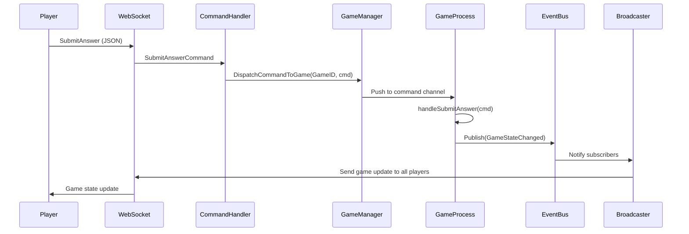

```mermaid
sequenceDiagram
    participant Player
    participant WebSocket
    participant CommandHandler
    participant GameManager
    participant GameProcess
    participant EventBus
    participant Broadcaster

    Player->>WebSocket: SubmitAnswer (JSON)
    WebSocket->>CommandHandler: SubmitAnswerCommand
    CommandHandler->>GameManager: DispatchCommandToGame(GameID, cmd)
    GameManager->>GameProcess: Push to command channel
    GameProcess->>GameProcess: handleSubmitAnswer(cmd)
    GameProcess->>EventBus: Publish(GameStateChanged)
    EventBus->>Broadcaster: Notify subscribers
    Broadcaster->>WebSocket: Send game update to all players
    WebSocket->>Player: Game state update
```