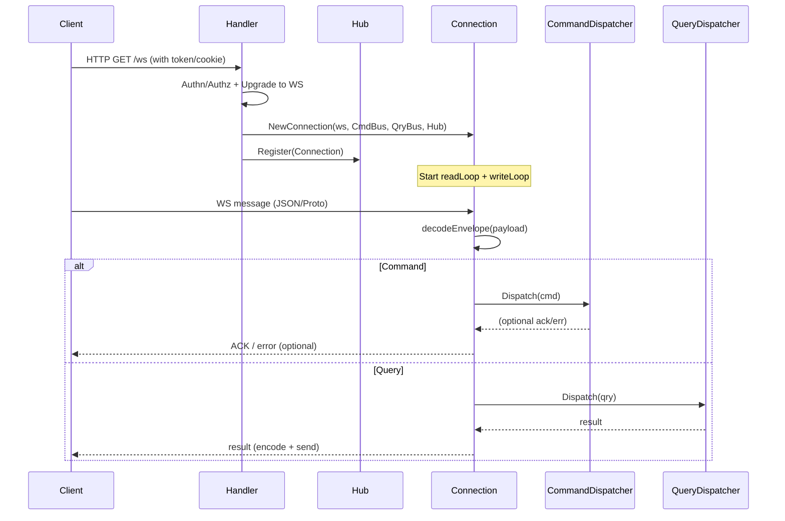
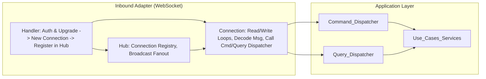

```mermaid
sequenceDiagram
    participant Client
    participant Handler
    participant Hub
    participant Connection
    participant CmdBus as CommandDispatcher
    participant QryBus as QueryDispatcher

    Client->>Handler: HTTP GET /ws (with token/cookie)
    Handler->>Handler: Authn/Authz + Upgrade to WS
    Handler->>Connection: NewConnection(ws, CmdBus, QryBus, Hub)
    Handler->>Hub: Register(Connection)
    Note over Connection: Start readLoop + writeLoop

    Client->>Connection: WS message (JSON/Proto)
    Connection->>Connection: decodeEnvelope(payload)
    alt Command
        Connection->>CmdBus: Dispatch(cmd)
        CmdBus-->>Connection: (optional ack/err)
        Connection-->>Client: ACK / error (optional)
    else Query
        Connection->>QryBus: Dispatch(qry)
        QryBus-->>Connection: result
        Connection-->>Client: result (encode + send)
    end
```

```mermaid
flowchart LR
    subgraph InboundAdapter["Inbound Adapter (WebSocket)"]
        H[Handler: Auth & Upgrade -> New Connection -> Register in Hub]
        C[Connection: Read/Write Loops, Decode Msg, Call Cmd/Query Dispatcher]
        U[Hub: Connection Registry, Broadcast Fanout]
    end

    subgraph App["Application Layer"]
        CMD[Command_Dispatcher]
        QRY[Query_Dispatcher]
        SRV[Use_Cases_Services]
    end

    H --> C
    H --> U
    C --> CMD
    C --> QRY
    CMD --> SRV
    QRY --> SRV
    U --> C
```