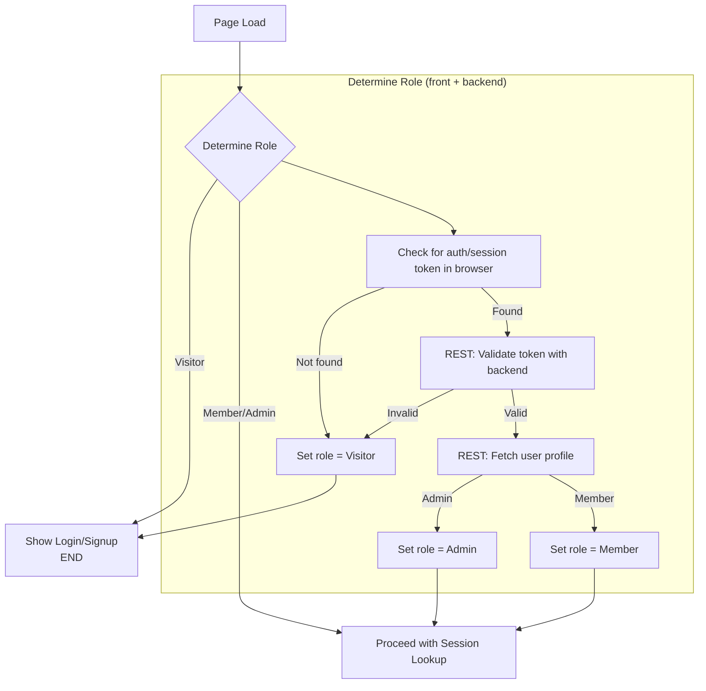

```mermaid
flowchart TD
    A[Page Load] --> B{Determine Role}
    B -- Visitor --> C[Show Login/Signup<br/>END]
    B -- Member/Admin --> D[Proceed with Session Lookup]

    %% Subgraph for Determine Role detail
    subgraph "Determine Role (front + backend)"
      direction TB
      B --> B1[Check for auth/session token in browser]
      B1 -- Not found --> B2[Set role = Visitor]
      B1 -- Found --> B3[REST: Validate token with backend]
      B3 -- Invalid --> B2
      B3 -- Valid --> B4[REST: Fetch user profile]
      B4 -- Admin --> B5[Set role = Admin]
      B4 -- Member --> B6[Set role = Member]
    end

    B2 --> C
    B5 --> D
    B6 --> D
```