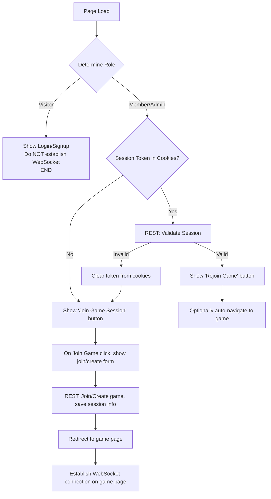

```mermaid
flowchart TD
    A[Page Load] --> B{Determine Role}
    B -- Visitor --> C[Show Login/Signup<br/>Do NOT establish WebSocket<br/>END]
    B -- Member/Admin --> D{Session Token in Cookies?}
    D -- "No" --> E[Show 'Join Game Session' button]
    D -- "Yes" --> F[REST: Validate Session]
    F -- "Valid" --> G[Show 'Rejoin Game' button]
    F -- "Invalid" --> H[Clear token from cookies]
    H --> E
    G --> I[Optionally auto-navigate to game]
    E --> J[On Join Game click, show join/create form]
    J --> K[REST: Join/Create game, save session info]
    K --> L[Redirect to game page]
    L --> M[Establish WebSocket connection on game page]
```