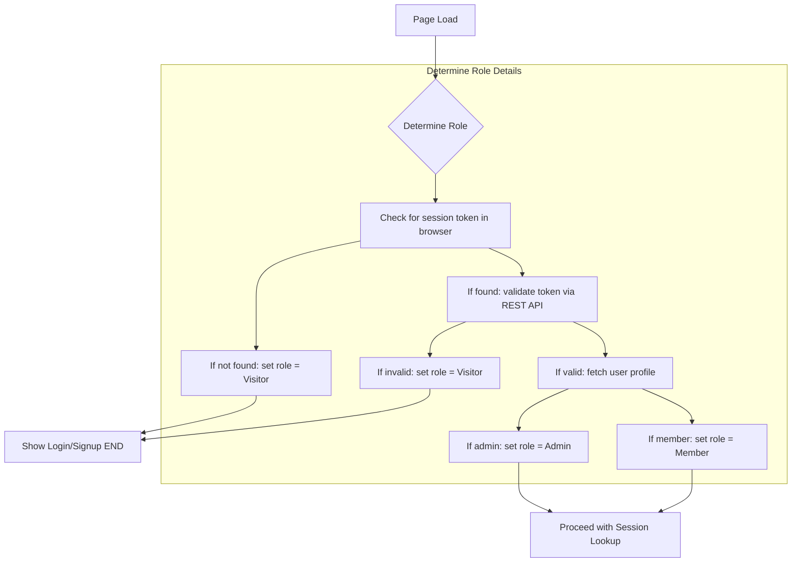

```mermaid
flowchart TD
    A1[Page Load]
    A2{Determine Role}
    A1 --> A2
    subgraph "Determine Role Details"
        A2.1[Check for session token in browser]
        A2.1.1[If not found: set role = Visitor]
        A2.1.2[If found: validate token via REST API]
        A2.1.2.1[If invalid: set role = Visitor]
        A2.1.2.2[If valid: fetch user profile]
        A2.1.2.2.1[If admin: set role = Admin]
        A2.1.2.2.2[If member: set role = Member]
        A2 --> A2.1
        A2.1 --> A2.1.1
        A2.1 --> A2.1.2
        A2.1.2 --> A2.1.2.1
        A2.1.2 --> A2.1.2.2
        A2.1.2.2 --> A2.1.2.2.1
        A2.1.2.2 --> A2.1.2.2.2
    end
    A2.1.1 --> B1[Show Login/Signup END]
    A2.1.2.1 --> B1
    A2.1.2.2.1 --> B2[Proceed with Session Lookup]
    A2.1.2.2.2 --> B2
```