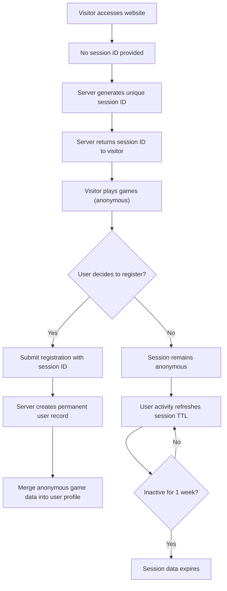

```mermaid
flowchart TD
    A[Visitor accesses website] --> B[No session ID provided]
    B --> C[Server generates unique session ID]
    C --> D[Server returns session ID to visitor]
    D --> E["Visitor plays games (anonymous)"]
    E --> F{"User decides to register?"}
    F -- Yes --> G[Submit registration with session ID]
    G --> H[Server creates permanent user record]
    H --> I[Merge anonymous game data into user profile]
    F -- No --> J[Session remains anonymous]
    J --> K[User activity refreshes session TTL]
    K --> L{"Inactive for 1 week?"}
    L -- Yes --> M[Session data expires]
    L -- No --> K
```