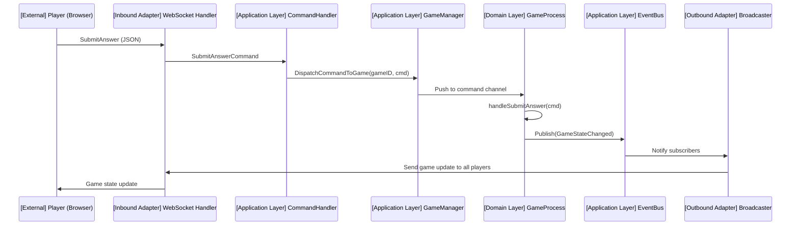

```mermaid
sequenceDiagram
    %% Legend: [Layer] Component
    participant Player as [External] Player (Browser)
    participant WSHandler as [Inbound Adapter] WebSocket Handler
    participant CmdHandler as [Application Layer] CommandHandler
    participant GameMgr as [Application Layer] GameManager
    participant GameProc as [Domain Layer] GameProcess
    participant EventBus as [Application Layer] EventBus
    participant Broadcaster as [Outbound Adapter] Broadcaster

    Player->>WSHandler: SubmitAnswer (JSON)
    WSHandler->>CmdHandler: SubmitAnswerCommand
    CmdHandler->>GameMgr: DispatchCommandToGame(gameID, cmd)
    GameMgr->>GameProc: Push to command channel
    GameProc->>GameProc: handleSubmitAnswer(cmd)
    GameProc->>EventBus: Publish(GameStateChanged)
    EventBus->>Broadcaster: Notify subscribers
    Broadcaster->>WSHandler: Send game update to all players
    WSHandler->>Player: Game state update
```